# Scene Gen Agent

> **Proof-of-concept for generative simulation**: an LLM agent that autonomously generates diverse 3D training environments in Unity, inspired by the data synthesis challenges in robotics foundation model training.
>
> Now extended into a full material-to-scene pipeline: real-world material capture → PBR texture generation via ControlNet → LLM scene design → automated evaluation.

## Current Direction

Building a fully automated pipeline from real material photos to Unity-ready PBR texture sets, driven by LLM scene design and evaluated by Claude Vision API. Primary motivation: demonstrate scalable environment data synthesis applicable to robotics foundation model training and XR spatial computing. Portfolio target: Foster + Partners Applied R+D, Software Developer XR.

**Active phase:** Phase 1 — Material Capture to PBR Texture Pipeline (Steps 1.1–1.6 complete as of 19 Jun 2026)

---

## Demo

### 360° Orbit — Dark Warehouse (5 Variants)
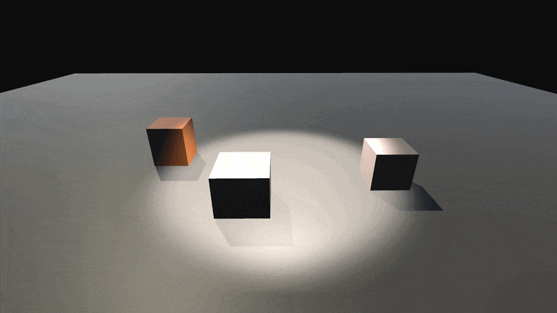

| Variant 00 | Variant 01 | Variant 02 |
|---|---|---|
| 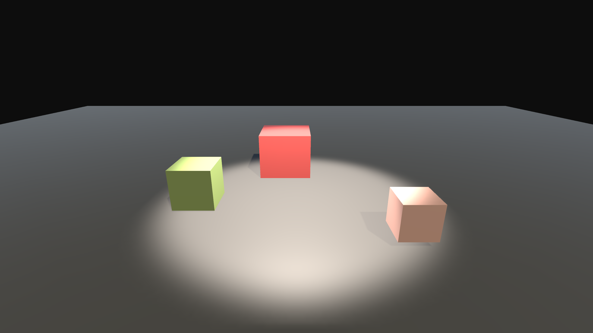 | 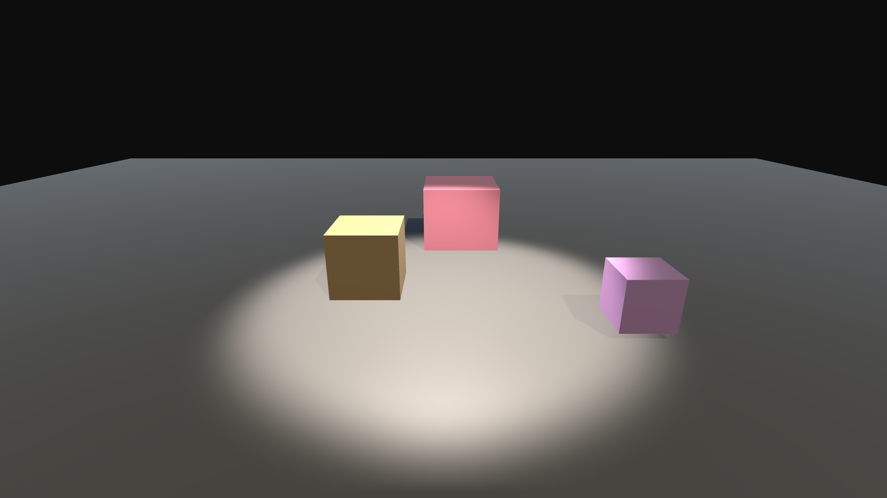 | 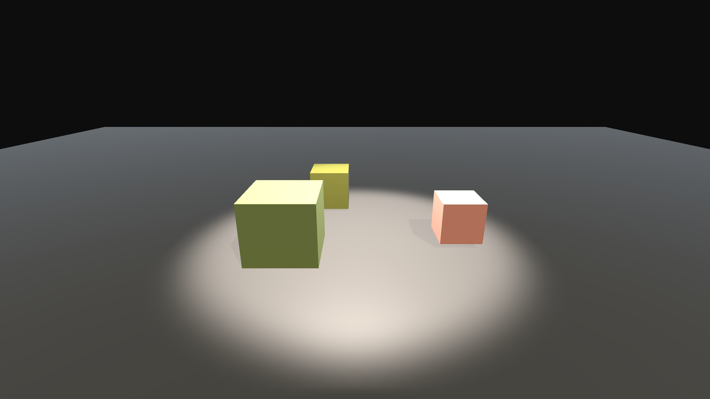 |

| Variant 03 | Variant 04 | |
|---|---|---|
| 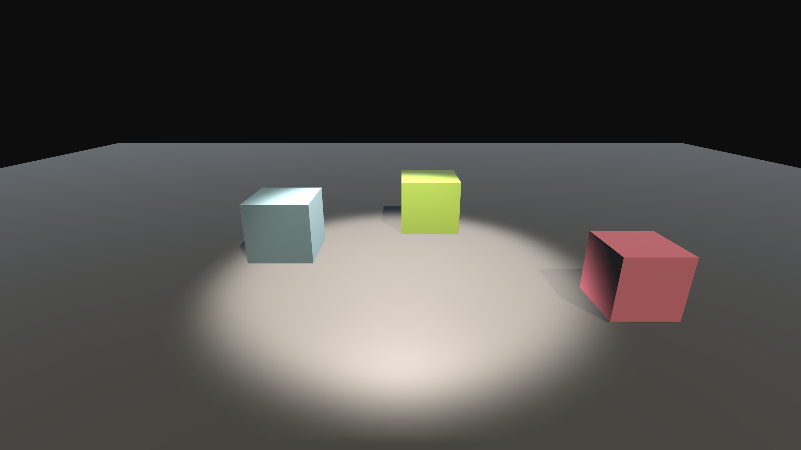 | 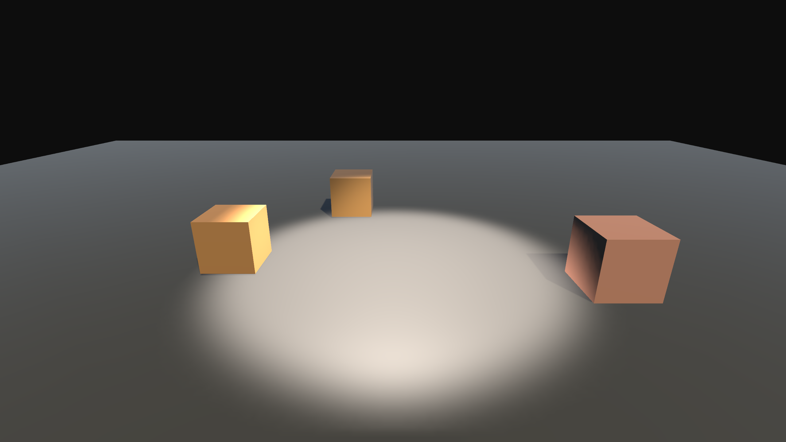 | |

### Laboratory Scene
| Variant 00 | Variant 01 | Variant 02 |
|---|---|---|
|  | 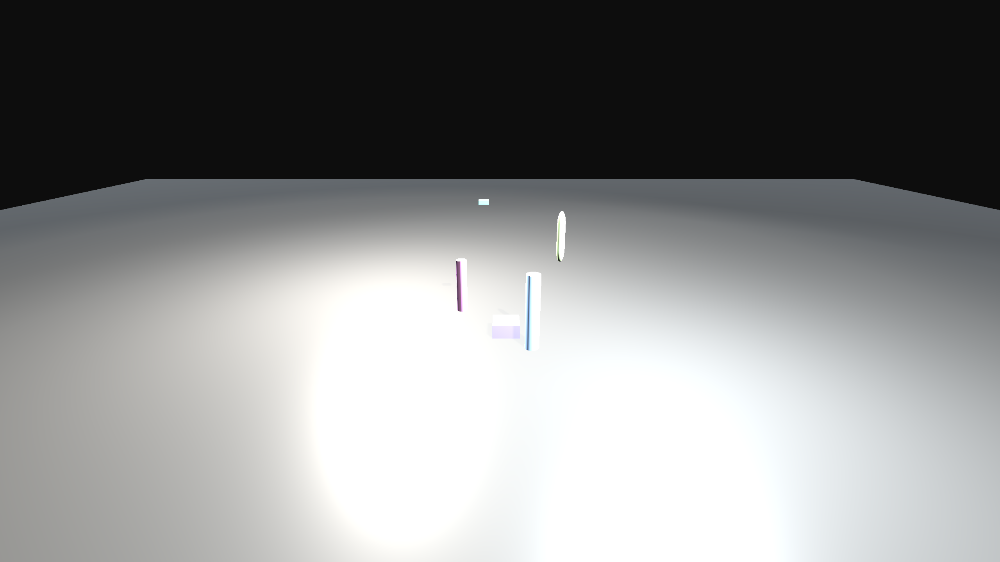 | 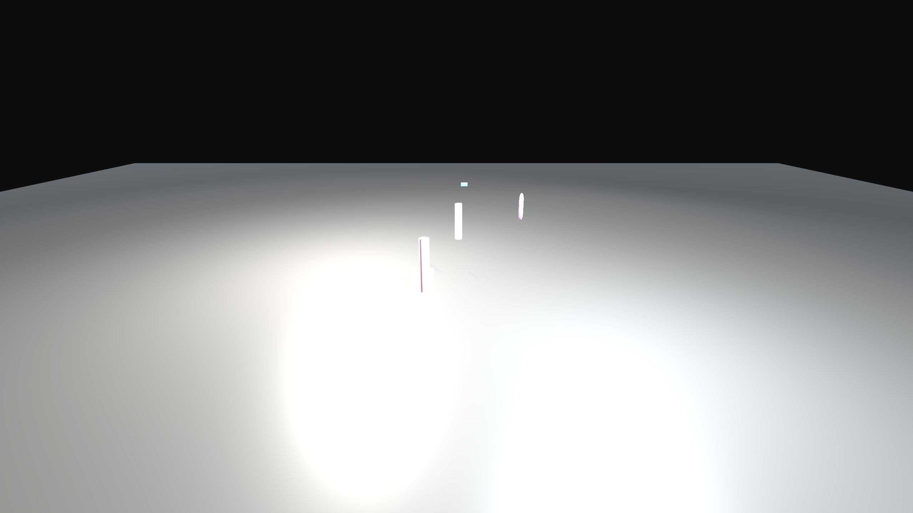 |

### Outdoor Scene
| Variant 00 | Variant 01 | Variant 02 |
|---|---|---|
| 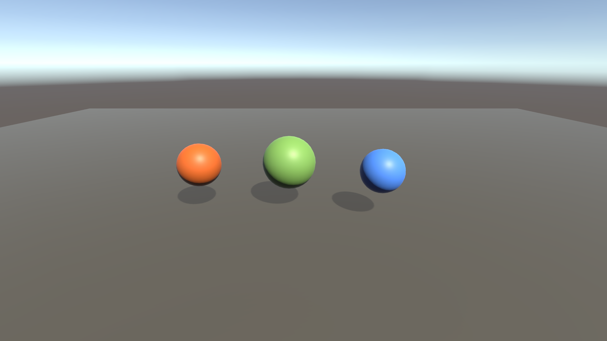 | 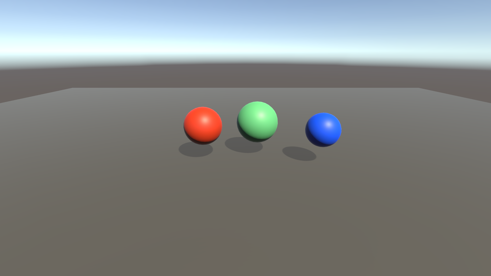 | 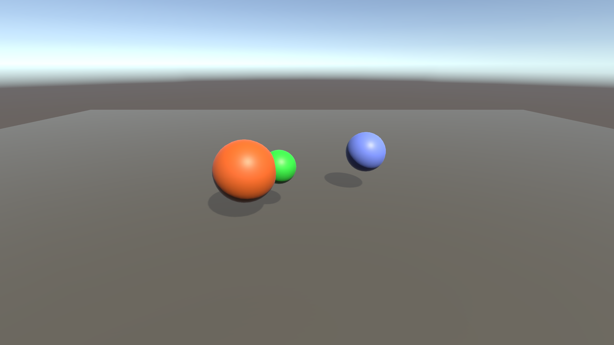 |

---

## Overview

Scene Gen Agent is a pipeline that takes a natural language description and automatically generates diverse 3D scenes in Unity Engine.

Given a single text prompt, the system:
1. Interprets the description via Claude API (LLM agent)
2. Outputs a structured JSON scene configuration
3. Spawns 3D objects, lighting, and environment in Unity
4. Generates multiple randomized variants from a single prompt

**Result: 3 prompts → 15 unique scenes, fully automated.**

---

## System Architecture

### Original Pipeline

```
Text Prompt
  │
  ▼
Claude API ──────── LLM Scene Interpreter
  │
  ▼
scene.json ─────── Structured scene config
  │                (objects, lights, environment)
  ▼
Unity C# Script ── Auto scene generation
  │
  ▼
Scene Variants ─── Seed-based randomization
  │                (position, scale, color)
  ▼
Output ─────────── Screenshots + 360° orbit video
```

### Extended Pipeline (in development)

```
Real Material Photo
  │
  ▼
Preprocessing ────── Lighting removal, diffuse flatten
  │
  ▼
ControlNet ──────── Albedo refinement + Normal map generation
  │
  ▼
PBR Texture Set ─── albedo / normal / roughness / metallic
  │
  ▼
Material Metadata ── Dominant color, category, roughness value
  │
  ▼
Claude API ──────── LLM interior scene design from material input
  │
  ▼
scene.json ─────── Scene config with material assignment
  │
  ▼
Unity Scene ─────── Auto-generated + texture applied
  │
  ▼
Claude Vision API ── Automated evaluation (coherence, lighting, composition)
  │
  ▼
evaluation_report.json
```

---

## Relevance

### Robotics Data Synthesis
Training robust robotics foundation models requires massive amounts of diverse environment data. Manual scene creation does not scale. This project demonstrates a core primitive of that pipeline:

- **LLM as scene interpreter** — translates semantic descriptions into structured 3D configurations
- **Automatic variation** — seed-based randomization generates diverse training samples from a single prompt
- **Structured output** — JSON schema bridges the LLM and simulation engine
- **Extensible** — scales to complex manipulation environments, object placement policies, and domain randomization for sim-to-real transfer

### XR and Spatial Computing
The extended pipeline addresses a recurring problem in XR and architectural visualization: bringing real-world materials into digital environments at scale, without manual authoring for each asset.

---

## Tech Stack

| Layer | Technology |
|---|---|
| LLM Agent | Claude API (claude-sonnet-4-5) |
| Image Pipeline | Python 3 + ComfyUI + ControlNet |
| Simulation | Unity 6 (Built-in Render Pipeline) |
| Scene Format | JSON |
| Version Control | Git / GitHub |
| CI/CD | GitHub Actions (planned) |

---

## Quick Start

### 1. Clone and Setup

```bash
git clone https://github.com/DuruphilLeeGwak/scene-gen-agent.git
cd scene-gen-agent
python -m venv venv
venv\Scripts\activate
pip install anthropic python-dotenv opencv-python Pillow numpy
```

### 2. Set API Key

Create `.env` in the root directory:

```
ANTHROPIC_API_KEY=your_api_key_here
```

### 3. Run the Material-to-PBR Pipeline

Drop raw material photos into `pipeline/input/raw/`, then:

```bash
# Start ComfyUI first, then:
python python/pipeline.py --material concrete
```

Output: `pipeline/output/YYYY-MM-DD_concrete/`
```
001_source_crop.png   # preprocessed input
001_albedo.png        # ControlNet Tile output
001_normal.png        # Sobel gradient normal map
001_roughness.png     # rule-based roughness
001_metallic.png      # rule-based metallic
```

### 4. Generate a Scene (original pipeline)

```bash
python python/prompt_to_scene.py "dark warehouse with 3 boxes and 1 spotlight"
```

### 4. Load in Unity

- Open `SceneGenAgent` project in Unity 6
- Enable `CameraOrbit` component on the `SceneLoader` object
- Press Play — 5 scene variants auto-generated and recorded

---

## Example Prompts

```
"dark warehouse with 3 boxes and 1 spotlight"
"bright laboratory with robot arm and 2 point lights"
"outdoor area with 3 spheres and directional sunlight"
```

---

## Project Structure

```
scene-gen-agent/
├── pipeline/
│   ├── input/
│   │   └── raw/                  # Drop source material photos here (gitignored)
│   └── output/                   # Auto-generated per run: YYYY-MM-DD_<material>/
├── python/
│   ├── prompt_to_scene.py        # Claude API → JSON pipeline
│   ├── capture_to_pbr.py         # Material photo → source_crop (Step 1.1)
│   ├── comfy_albedo.py           # ComfyUI API → albedo via ControlNet Tile (Step 1.2)
│   ├── gen_normal.py             # Albedo → normal map via Sobel gradient (Step 1.3)
│   ├── gen_roughness_metallic.py # Albedo → roughness + metallic maps (Step 1.4)
│   └── pipeline.py               # Full pipeline entry point: Steps 1.1–1.4 (Step 1.5)
├── SceneGenAgent/
│   └── Assets/
│       └── Scripts/
│           ├── SceneLoader.cs        # JSON → Unity scene generation
│           ├── SceneVariant.cs       # Seed-based random variation
│           ├── CameraOrbit.cs        # 360° orbit recorder
│           └── MaterialValidator.cs  # PBR texture preview under 3 lighting conditions (Step 1.6)
├── docs/
│   ├── demo_warehouse.gif
│   └── images/
│       ├── warehouse_00.png
│       ├── lab_00.png
│       ├── outdoor_00.png
│       └── validation/               # Step 1.6 render outputs: neutral / warm / cool
└── README.md
```

---

## Development Roadmap

**Target: 18 Jun 2026 – 16 Jul 2026 (approx. 4 weeks, 1 hour/day)**

---

### Phase 1 — Material Capture to PBR Texture Pipeline
**18 Jun – 2 Jul**

Goal: Given a single smartphone photo of a real material, automatically output a PBR texture set ready for use in Unity or Unreal Engine 5.

---

**Step 1.1 — Capture and Preprocessing**

Remove lighting influence from raw photo. Flatten to diffuse color only.

- [x] Select first test material (concrete, stone, or fabric)
- [x] Photograph under consistent lighting conditions
- [x] Write Python script to normalize brightness and reduce specular highlights
- [x] Output: cleaned source image ready for ControlNet

**Cleared:** 18 Jun 2026

---

**Step 1.2 — ControlNet Albedo Refinement**

Use ControlNet (Canny or Tile model) to generate a lighting-free albedo from the cleaned photo.

- [x] Set up ComfyUI workflow with ControlNet Canny or Tile conditioning
- [x] Tune prompt and denoise strength for material type
- [x] Validate output: albedo should be flat, no baked shadows
- [x] Output: `albedo.png`

**Cleared:** 18 Jun 2026

**Notes:** Color output natural. Texture slightly artificial — may need denoise tuning per material category. Shadow/lighting removal result inconclusive; revisit if downstream steps reveal issues.

---

**Step 1.3 — Normal Map Generation**

Generate a physically plausible normal map from the source image.

- [x] Test ControlNet normal map model output
- [x] Compare with height-to-normal conversion (numpy fallback)
- [x] Select best method per material category
- [x] Output: `normal.png`

**Cleared:** 18 Jun 2026

**Notes:** Chose numpy Sobel gradient over ControlNet NormalBae to avoid additional model downloads. Output visually imperfect but acceptable for current stage.

---

**Step 1.4 — Roughness and Metallic Estimation**

Rule-based estimation guided by material category input.

- [x] Define material category list (metal / fabric / wood / stone / concrete / ceramic)
- [x] Write roughness and metallic range lookup per category
- [x] Apply color analysis to refine roughness within category range
- [x] Output: `roughness.png`, `metallic.png`

**Cleared:** 18 Jun 2026

**Notes:** Outputs are uniform flat maps — physically correct for concrete (metallic=0.0, roughness≈0.85). Spatial variation not required at this stage.

---

**Step 1.5 — Pipeline Integration and Output**

Wire all steps into a single Python script. Standardize output format.

- [x] Single entry point: `python pipeline.py --material <category>`
- [x] Output folder: `pipeline/output/YYYY-MM-DD_<material>/` with 4 textures and source image
- [x] File naming: `<n>_source_crop.png`, `<n>_albedo.png`, `<n>_normal.png`, `<n>_roughness.png`, `<n>_metallic.png`
- [x] README usage example updated

**Cleared:** 18 Jun 2026

---

**Step 1.6 — Unity / UE5 Material Validation**

Apply generated textures in engine. Verify physical plausibility under different lighting.

- [x] Import texture set into Unity (Built-in or HDRP)
- [ ] Import texture set into UE5 (optional)
- [x] Render under 3 lighting conditions: neutral, warm, cool
- [x] Side-by-side comparison: real material photo vs rendered material
- [x] Output: render screenshots for portfolio

**Cleared:** 19 Jun 2026

**Notes:** `MaterialValidator.cs` attached to a scene GameObject. Set albedoPath / normalPath / roughnessPath / metallicPath in Inspector to pipeline output folder. Press Play — 3 screenshots auto-saved to `docs/images/validation/`. UE5 import deferred.

---

### Phase 2 — LLM Scene Design from Material Metadata
**3 Jul – 9 Jul**

Goal: Feed material properties extracted from Phase 1 into Claude API to automatically design an interior scene layout.

---

**Step 2.1 — Material Metadata Extraction**

- [ ] Extract dominant color, texture frequency, and estimated material category from Phase 1 output
- [ ] Format as structured JSON: `{ "category": "stone", "color": "#8B8B7A", "roughness": 0.8 }`

**Cleared:** —

---

**Step 2.2 — LLM Scene Interpreter**

Extension of the original `prompt_to_scene.py`.

- [ ] Extend pipeline to accept material metadata as input alongside text prompt
- [ ] Design system prompt: LLM generates interior scene configuration from given material
- [ ] Output: `scene.json` with object placement, lighting, and environment settings

**Cleared:** —

---

**Step 2.3 — Scene Generation in Unity**

- [ ] Update `SceneLoader.cs` to support material assignment from texture set
- [ ] Auto-apply Phase 1 textures to generated scene objects
- [ ] Generate 5 variants with seed-based randomization

**Cleared:** —

---

**Step 2.4 — GitHub Actions CI/CD** *(new)*

Add automated testing and validation to the pipeline.

- [ ] Write unit test for `prompt_to_scene.py` JSON output schema
- [ ] Write unit test for `capture_to_pbr.py` output file existence
- [ ] Set up GitHub Actions workflow: runs tests on every push
- [ ] Badge added to README

**Cleared:** —

---

### Phase 3 — Automated Evaluation
**10 Jul – 16 Jul**

Goal: Use Claude Vision API to evaluate generated scenes for material coherence, lighting interaction, and spatial quality.

---

**Step 3.1 — Evaluation Criteria Definition**

- [ ] Define scoring dimensions: material consistency, lighting plausibility, spatial composition
- [ ] Write evaluation prompt for Claude Vision API
- [ ] Output: JSON score per scene variant

**Cleared:** —

---

**Step 3.2 — Evaluation Pipeline**

- [ ] Capture screenshots of generated scenes automatically
- [ ] Pass to Claude Vision API with evaluation prompt
- [ ] Aggregate scores across variants
- [ ] Output: `evaluation_report.json`

**Cleared:** —

---

**Step 3.3 — Feedback Loop** *(optional)*

- [ ] Use evaluation scores to re-prompt LLM for improved scene configuration
- [ ] Run one iteration of prompt refinement based on lowest-scoring dimension
- [ ] Document improvement delta

**Cleared:** —

---

## Progress Log

| Date | Step | Work Done |
|---|---|---|
| 18 Jun 2026 | — | Project roadmap initialized. Extended pipeline direction defined. |
| 18 Jun 2026 | 1.1 | `capture_to_pbr.py` written. Background crop (contour bounding box) + CLAHE brightness flatten + 512×512 resize. `pipeline/` folder structure created. 4 test material photos processed. |
| 18 Jun 2026 | 1.2 | `comfy_albedo.py` written. ComfyUI API + ControlNet Tile (denoise 0.4) → `albedo.png` x4. Color output natural; texture slightly artificial, shadow removal inconclusive — to revisit if needed. |
| 18 Jun 2026 | 1.3 | `gen_normal.py` written. Numpy Sobel gradient → normal map. No extra model download. Output visually imperfect but acceptable. |
| 18 Jun 2026 | 1.4 | `gen_roughness_metallic.py` written. Rule-based lookup (6 material categories) + albedo variance refinement. Flat uniform maps output. |
| 18 Jun 2026 | 1.5 | `pipeline.py` written. Single entry point wiring Steps 1.1–1.4 via subprocess. |
| 19 Jun 2026 | 1.6 | `MaterialValidator.cs` written. Loads PBR textures at runtime, applies to preview plane, captures 3 lighting conditions. Screenshots → `docs/images/validation/`. |
| 18 Jun 2026 | 1.3 | `gen_normal.py` written. Numpy Sobel gradient → `normal.png` x4. ControlNet NormalBae skipped to avoid extra model download. Output imperfect but acceptable. |
| 18 Jun 2026 | 1.4 | `gen_roughness_metallic.py` written. Rule-based lookup per material category + albedo variance analysis → `roughness.png`, `metallic.png` x4. Flat uniform maps, physically correct for concrete. |
| 18 Jun 2026 | 1.5 | `pipeline.py` written. Single entry point wiring Steps 1.1–1.4 in sequence via subprocess. Output: `YYYY-MM-DD_<material>/` with 5 texture files per image. |

---

## Notes

- Phase 1 is the foundation. Do not proceed to Phase 2 until Step 1.6 render output is satisfactory.
- ControlNet method may vary per material category. Document which model works best for each.
- All render outputs go to `docs/images/` for portfolio use.
- Hyperlinks in PDF output are handled manually in InDesign.

---

## Author

**Jooyoung Gwak (두루필)**
Media Artist and Real-time Developer

- Unity / Unreal Engine interactive installation
- LLM agent pipeline development
- Generative simulation and AI driven content pipelines

[GitHub](https://github.com/DuruphilLeeGwak)
